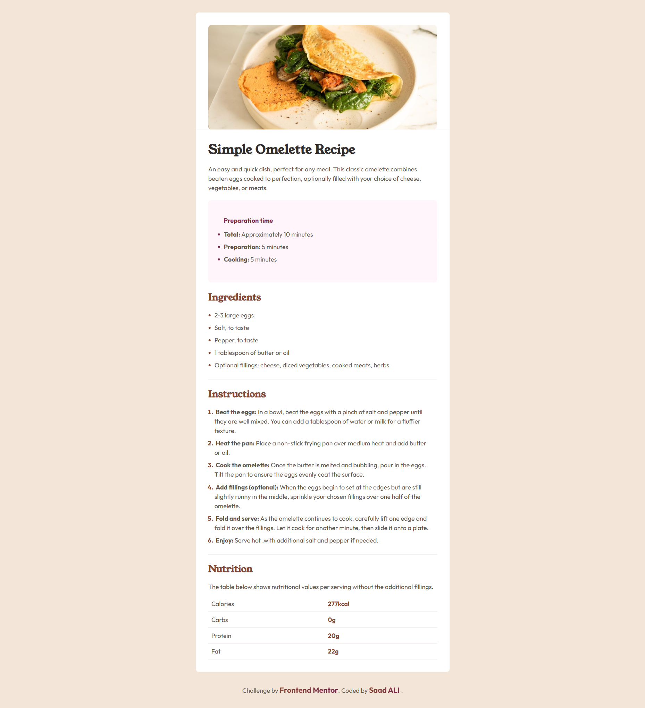
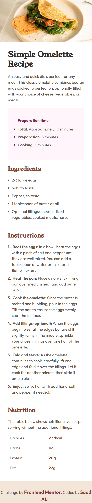

# 🍳 Frontend Mentor – Recipe Page Solution

This is a solution to the **Recipe Page** challenge on Frontend Mentor.  
Frontend Mentor challenges help you improve your coding skills by building realistic, production-ready components.

---

## 📋 Overview

### 🔹 The Challenge

Users should be able to:

- View the recipe page at its optimal layout on all screen sizes  
- See a clean and accessible layout with proper semantic structure  
- Experience a centered card layout using modern CSS techniques  
- View responsive images inside a semantic `<figure>`  
- Read content with a clear visual hierarchy and consistent typography  

---

## 🖼️ Screenshot

**Desktop View**  

**Mobile View**  

---

## 🔗 Links

- **Live Site URL:** [View Live](https://recipe-page-fm-nine.vercel.app/) 
---

## 💡 My Process

### 🔧 Built With

- Semantic **HTML5 markup** (`main`, `section`, `figure`, `table`)  
- **CSS Custom Properties** for colors & typography  
- Mobile-first workflow  
- **Flexbox** & **CSS Grid** for layout centering  
- Responsive images using `<figure>`  
- Clean, component-based class structure  
- Google Fonts: **Young Serif** & **Outfit**  

---

## 🧠 What I Learned

### ✔ Why `<figure>` is perfect for the recipe image  
Wrapping the main recipe photo inside a `<figure>` gives the image independent semantic meaning.  
It improves accessibility and communicates that the image belongs to the content, not just decoration.

### ✔ Strengthening Semantic HTML

- Proper use of `<section>` for grouped content  
- Using `<table>` for structured nutrition data  
- Maintaining a clear heading hierarchy (`h1 → h2`)  
- Writing descriptive, accessible `alt` text  
 

---

## 📚 Useful Resources

- **MDN – Semantic HTML**  
  Great reference for choosing correct structural elements.

- [**Kevin Powell – YouTube Channel**](https://www.youtube.com/@KevinPowell)  
  Excellent resource for understanding simple UI layouts and modern CSS best practices.

---

## 👨‍💻 Author

- **Frontend Mentor:** [@Saad Ali](https://www.frontendmentor.io/profile/ByteSaad)  
- **GitHub:** [@ByteSaad](https://github.com/ByteSaad)
